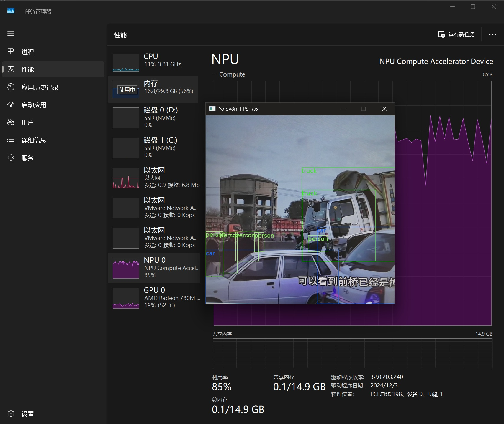

# RyzenAI with Rust and ONNX Runtime (ORT) Guide

This project demonstrates how to use Rust with the ONNX Runtime (ORT) library to interact with RyzenAI models.

## Project Introduction

### Setting Up the Environment

1. Install NPU Driver and RyzenAI Environment Library

[Installation Instructions](https://ryzenai.docs.amd.com/en/latest/inst.html)

2. Copy and Initialize Runtime Environment
```sh
python copy_runtime.py
```

* Linux env
```sh
cd runtime
./init.sh
source env.sh
```

### 1. ResNet Example
This example demonstrates how to use ONNX Runtime to load a ResNet model and perform inference on the CIFAR-10 dataset.

Reference: [Getting Started Example](https://github.com/amd/RyzenAI-SW/tree/main/tutorial/getting_started_resnet)

```sh
cd resnet
cargo run
```

### 2. YOLOv8 Example

* Running on R9-7940HS NPU: XDNA1


1. Install VcPkg

* Set Up VCPKG_ROOT Environment Variable
```powershell
$env:VCPKG_ROOT = "C:\Users\PC\vcpkg"
$env:VCPKGRS_DYNAMIC=1
$env:PATH = "$env:VCPKG_ROOT;$env:PATH"
```

* Install SDL3
```powershell
vcpkg install sdl3
vcpkg install sdl3-ttf
```

2. Download Model
```sh
cd yolov8/model
python download.py
```

3. Run YOLOv8
```sh
cd yolov8
cargo run --release
```
